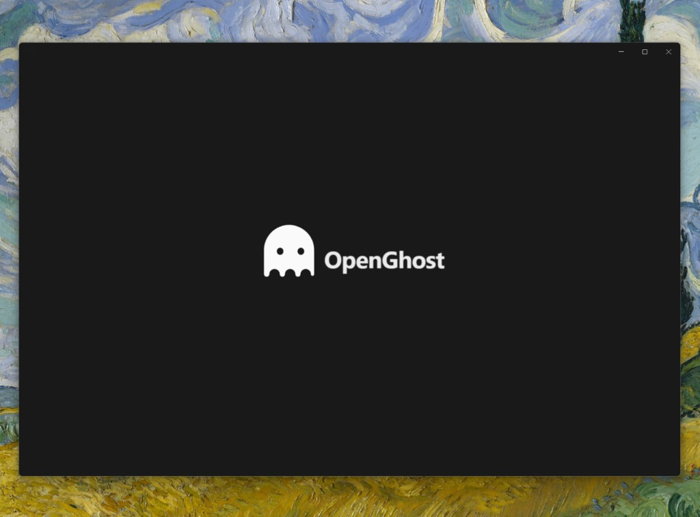
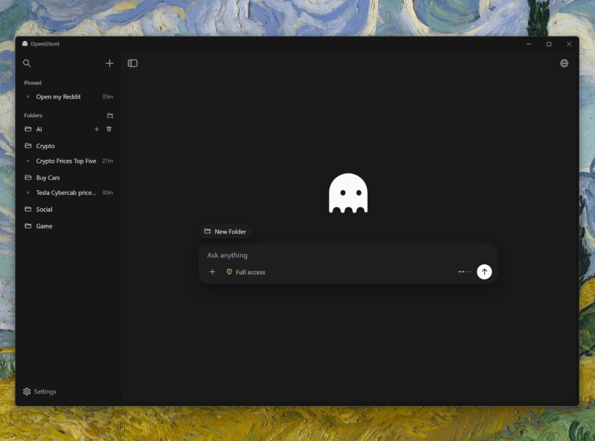
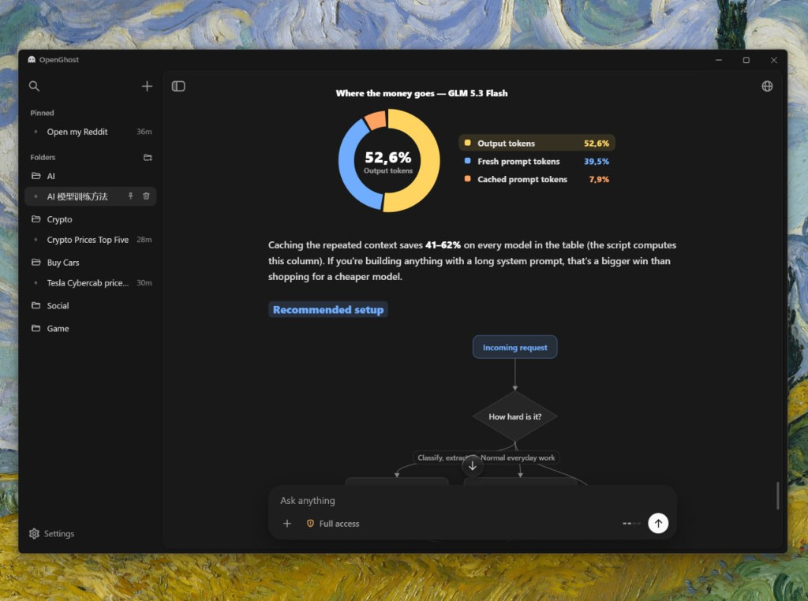
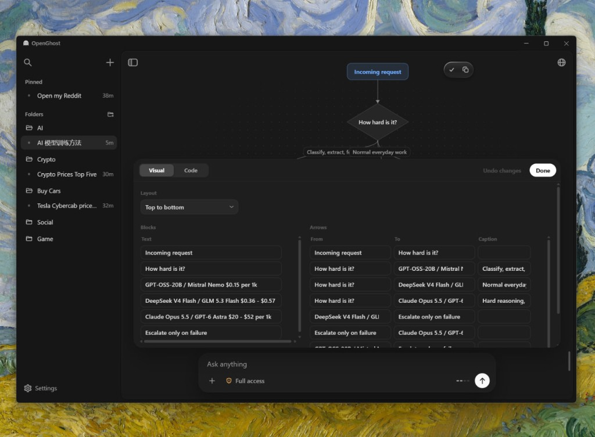
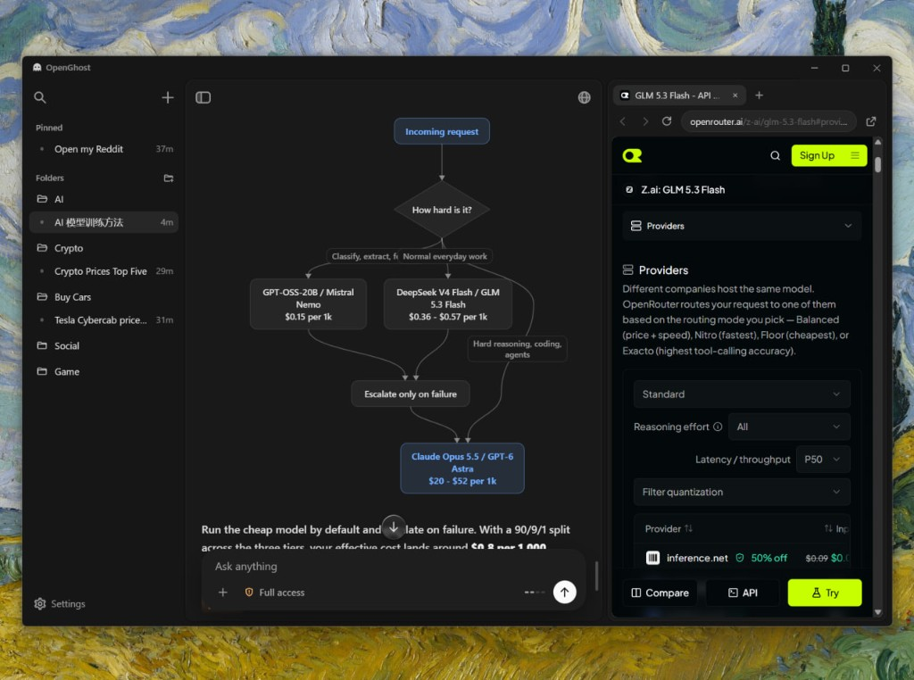
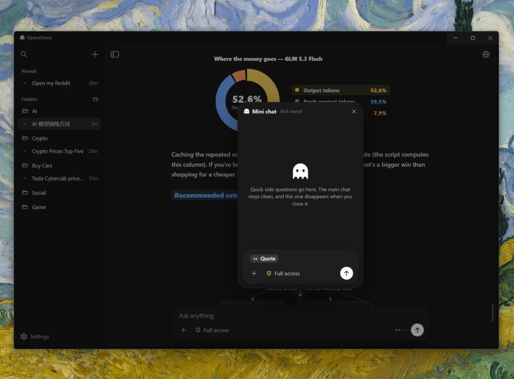
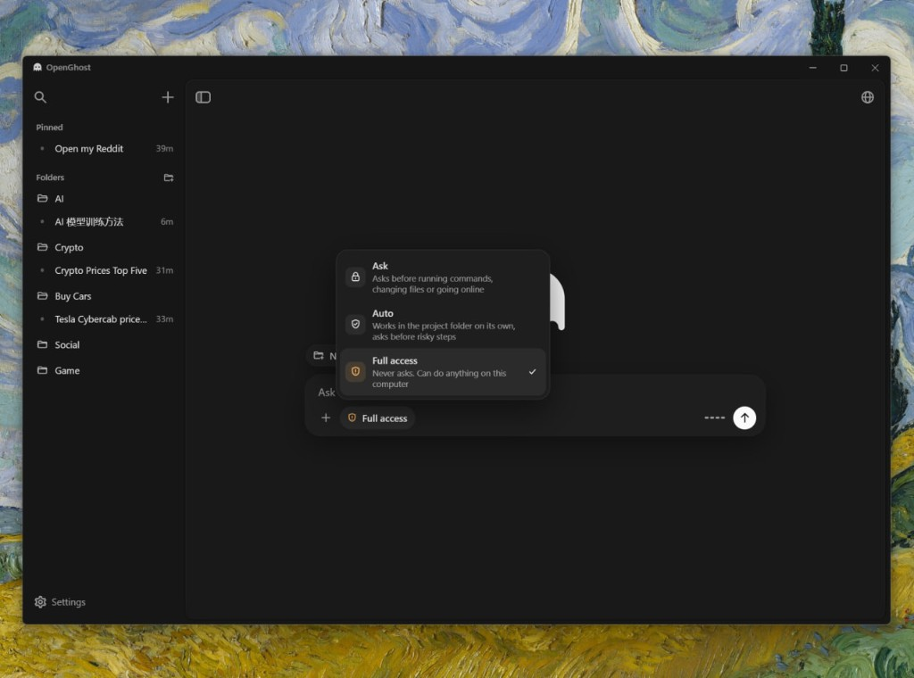
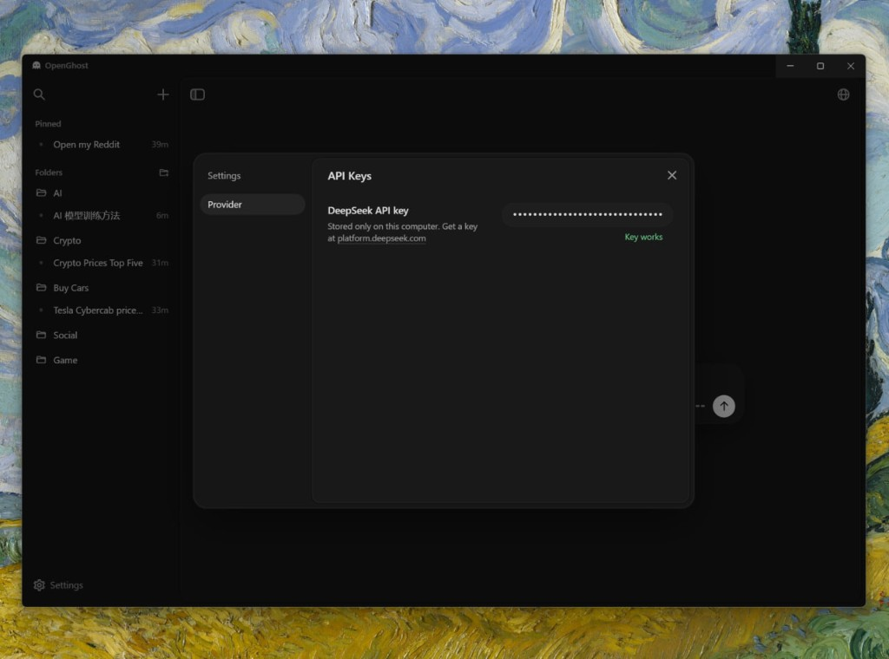

# OpenGhost

**v1.0.0 beta**

[Download for Windows](https://github.com/ANDRETRIPOL/OpenGhost/releases/download/v1.0.0/OpenGhost-Setup.exe)

The code is under the MIT license. The name OpenGhost, the ghost logo, the animations, and the visual design are not. You may not use those for any commercial purpose. See LICENSE.

OpenGhost is an open desktop agent for Windows. The agent engine is written from scratch. It runs commands, edits files, keeps git, and works on the web. Its main advantage is visualization: when something can be shown, OpenGhost draws it. The rendering engine is written from scratch too.

## It opens with the ghost

The app starts on its own screen. The ghost arrives first, then the name OpenGhost.

## A chat lives in a folder

Every new chat belongs to a folder you choose. Until the first message, the ghost waits above the composer.

## Show the numbers, do not only tell them

Shares, flows, prices, and plans become charts and diagrams next to the explanation. One picture carries the idea.

## Change the diagram where it stands

A chart is not a finished picture. Open it and edit the layout, the blocks, and the arrows. The drawing updates in place.

## A browser with its own cursor

OpenGhost has a built-in browser and drives it itself. It opens a page, moves its own cursor, clicks, types, and sees what is on the screen. The panel sits on the right of the chat. Close it and the agent still works.

## Mini chat for a side question

Select a passage and open Mini chat over the conversation. It is the same agent, with the current chat as context. Nothing written there is saved, and closing the window throws it away.

## Three ways to let it act

Ask waits for approval before commands, file changes, and the web. Auto works inside the project folder and asks before a risky step. Full access does not ask.

## The key stays on this computer

OpenGhost talks to DeepSeek with a key stored only on your machine. The app checks the key and tells you when it works.

