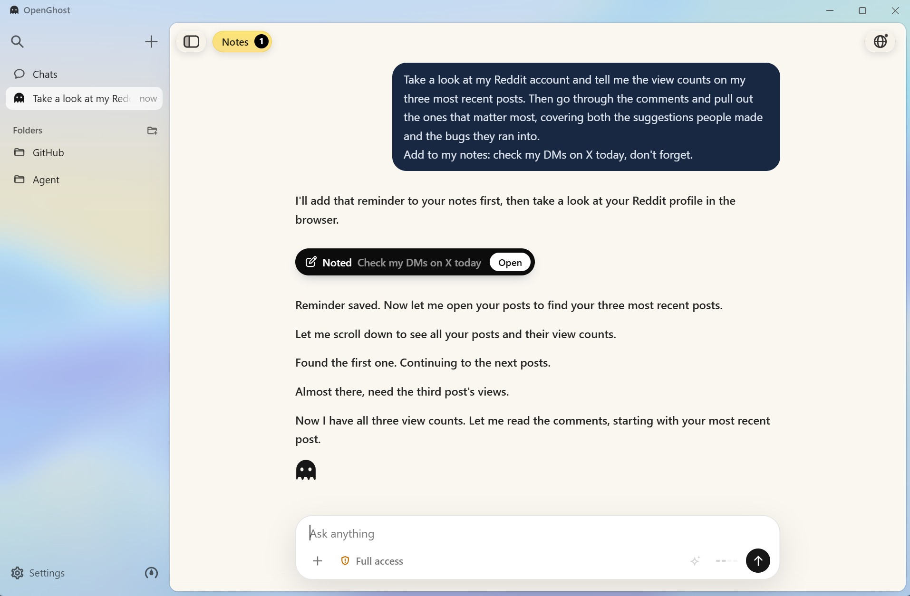
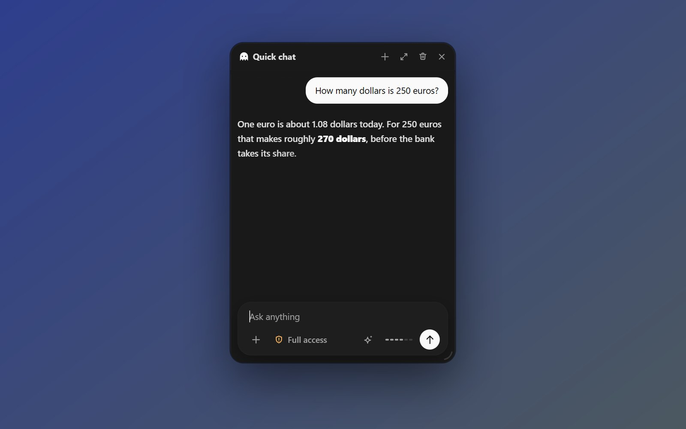
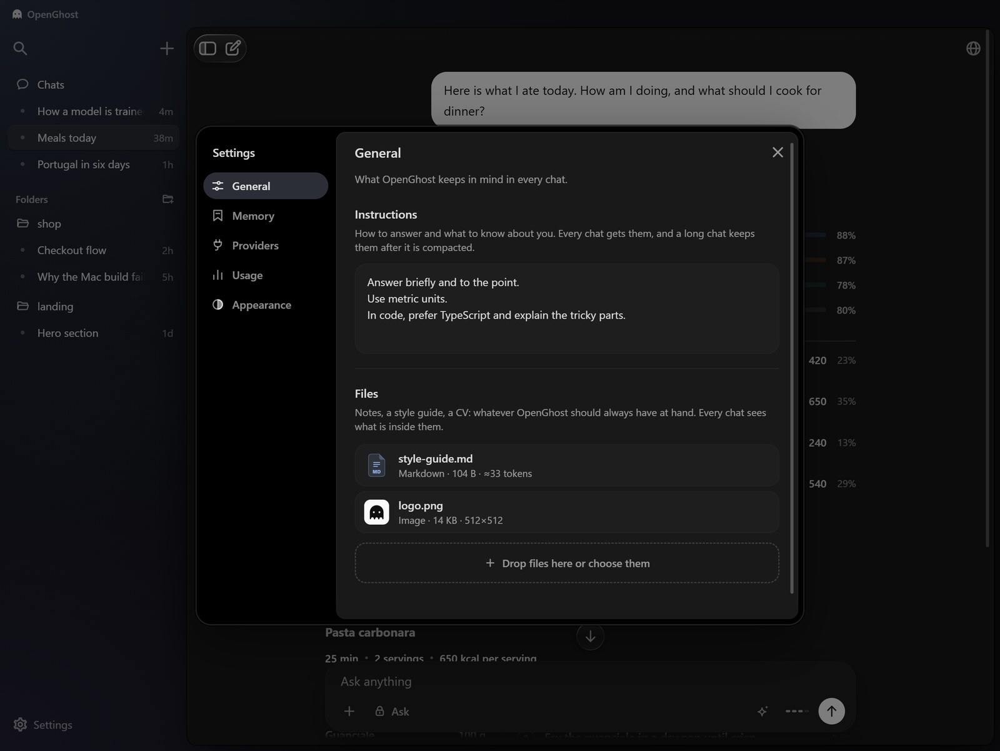
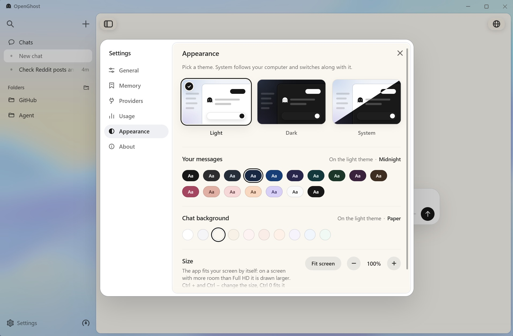

# OpenGhost

[](https://discord.gg/6cKd2UND5)

Website: [andretripol.github.io/OpenGhost](https://andretripol.github.io/OpenGhost/)

**v1.4.6 beta**

[Windows version 1.4.6](https://github.com/ANDRETRIPOL/OpenGhost/releases/download/v1.4.6/OpenGhost-1.4.6-Setup.exe)

[Linux version 1.4.6](https://github.com/ANDRETRIPOL/OpenGhost/releases/download/v1.4.6/OpenGhost-1.4.6-linux.tar.gz)

[macOS version 1.4.6](https://github.com/ANDRETRIPOL/OpenGhost/releases/download/v1.4.6/OpenGhost-1.4.6-mac.dmg)

What's new:
- The agent asks before it guesses. When a request can go several really different ways, the message field turns into a small deck of cards with choices; pick one or write your own answer. Clear requests are simply done.
- Languages: English, Italian, French and Russian, in Settings under General. There is an About section too.
- Limits at a glance: a button at the foot of the sidebar shows your ChatGPT limits and your DeepSeek and OpenRouter balances.
- One clear glass for the buttons over the chat, the notes, the search and the small menus; a tidier list of chats; photos open in a frame.
- macOS: the built-in browser names the system it really runs on, which fixes sites that misbehaved.
- Fixes: chats with many drawings open without jumping, Full Disk Access is detected on macOS, and more.

Older versions are on the [Releases](https://github.com/ANDRETRIPOL/OpenGhost/releases) page.

The code is under the MIT license. The name OpenGhost, the ghost logo, the animations, and the visual design are not: they stay with the author. A modified version may not be published or distributed with any of them, paid or free, and they may not be used for any commercial purpose. See LICENSE.

OpenGhost is an open desktop agent for Windows, macOS and Linux. It runs commands, edits files, keeps git and works on the web in a browser of its own. And it shows what it explains: charts, schemes, photos and videos stand next to the text.

## An agent built for visualization

OpenGhost is an agent built for visualization. When something is better shown than told, the answer comes with a drawing beside it, and the whole app is made so that reading and working with documents feels comfortable. A new chat needs no folder: type, and it goes to Chats at the top of the list, with a folder of its own for the files the agent makes. A chat about a project still lives in that project's folder.


## Written from scratch

Nothing in OpenGhost is assembled from ready parts. There is no UI framework inside, no Markdown library, no Mermaid, no chart library and no agent framework. Every part is our own code:

- **The agent.** The loop, the tools (commands, files, git, web search, pages, PDFs, video frames), the approval cards and the three permission modes.
- **The drawing engine.** It reads what a model writes, lays it out and draws it: 43 kinds of drawings, from flowcharts and loss curves to a day of meals and the route of a trip. A drawing is live: it answers the pointer and can be edited where it stands.
- **The browser.** The agent sees a page as text with numbered elements, moves its own cursor, clicks, types and reads, in a browser panel it shares with you.
- **The text.** The Markdown renderer that draws a reply while it is still being written, the code highlighter and the math.
- **The interface.** Every control, its motion and its glass, in plain JavaScript and CSS.

The app stands on two things only: Electron, which gives it a window, and Anthropic's official SDK, which talks to Claude.

## It shows what it explains

Ask how something works, and the answer comes with drawings: the whole as a scheme, the curves the topic is known for as charts, the key numbers as tiles. The engine knows more than forty kinds of drawings, from a day of meals and the route of a trip to the heavy charts of physics and any other science. Here one series of games stands as a mindmap of its universes and as a ring of what each universe holds.


## A scheme with the detail in it

A block carries its name and a line about what happens in it. Stages stand in groups, and a process that repeats closes into a ring.

## Drawings made for the subject

Food, recipes, documents, matches, languages, PC builds, device settings and trips have drawings of their own. A day of meals is a ring of calories with protein, fat and carbs against the goal.

A trip is a route with its legs, and words to learn come with their sound and an example.

## Change the drawing where it stands

A drawing is not a finished picture. Open it and change the layout, the blocks and the arrows in a table, or edit its source. The drawing follows as you type.

## Photos and videos in the reply

When a thing is better seen than described, a dish, a place, a game, the agent looks for pictures and videos itself. Pictures stand in a stack to leaf through, each with the page it came from. A video is a card with its preview, name and length, and a click opens it in your browser.

## A browser with its own cursor

OpenGhost has a built-in browser and drives it itself. It opens a page, moves its own cursor, clicks, types, and sees what is on the screen. The panel sits on the right of the chat. Close it and the agent still works.

## It works in your accounts

The browser panel is signed in where you are, so the agent works inside your own accounts and not only on open pages. A custom MCP server of ours gives it the control it needs over the sites it drives. One request can cover a whole round: open my Reddit account, tell me the view counts of my three most recent posts, then go through the comments and pull out the ones that matter, both the suggestions and the bugs people ran into.



## Notes it keeps an eye on

Ask the agent to write a note down, or write one yourself, for example "Add to my notes: check my DMs on X today". The notes stay in the list beside the chat, the agent reads them and keeps them in mind, and when a conversation arrives at what a note is about, the agent brings it up by itself and asks whether to deal with it now. It never acts on a note on its own.

## It remembers you

Tell OpenGhost about yourself once, in any chat, and every chat knows it: who you are, what you work with, how you like answers. It keeps short records, changes a record when the thing changes instead of writing a second one, and never keeps passwords or the details of one task. Everything it remembers is on one page of the settings, where you can rewrite a record, remove it, add your own, or switch the memory off.

A project can have its own instructions too: put an AGENTS.md in its folder, and the agent working there follows it.

## Find a chat

The magnifier, or Ctrl+K, opens a search in the middle of the chat. Type, and the chats it finds come out under it, each under its folder.

## Quick chat, from anywhere

Press Alt+Space, or the combination you set in Settings, and a small chat comes up over whatever is on screen: first its message field, then the rest. It is a full agent, called from anywhere: ask, read the answer, press Esc. It picks its own model and effort, searches the web, and keeps its chats in the list with a bolt; the arrows in its head open the chat in the app. Give its agent a task and close it, and the agent goes on with the app out of the way: the chat is marked when the answer is there, and you never had to open OpenGhost. With nothing to do, a closed quick chat sleeps.



## Mini chat, with an agent of its own

Open Mini chat over the conversation and ask the second question you have in mind. It floats: drag it by its head, pull the arc in its corner to resize it, and keep writing in the chat behind it. The agent inside is a full agent that sees the history of the main chat, and it works in parallel with the agent of the chat, in its own browser tab: the two coordinate and never get in each other's way, they only add to each other. Close a mini chat at work and its agent goes on by itself and finishes the task.


## What a chat costs

Chat stats, in the plus menu, show what a chat has spent: the tokens of every reply, the share of each model, how much of it came from the cache and how full the context is. Compact chat, next to it, frees the context of a long conversation, and the app does the same by itself before the model's window fills.

## Show it a photo, a video, a PDF

Photos, videos and files attach from the plus menu or by a drop. A video comes in like a photo, and the agent watches it frame by frame. A PDF is read as text, and its pages with photos, charts, formulas or scans are looked at as pictures.

## Tell it once, for every chat

The app itself speaks English, Italian, French and Russian, and you choose the language in Settings, under General. There too you write how to answer and what to know about you, and add the files OpenGhost should always have at hand: notes, a style guide, a CV. Every chat gets them, and a long chat keeps them after it is compacted.

The memory is the other side of the same page: everything OpenGhost has remembered about you is there to read and to change, to add to or to remove, or to switch off.



## Make it yours

Light, dark, or the system's theme; the size of the interface; and, new in 1.4.5, the colour of your own messages and of the chat's background, each theme keeping its own. Nothing is picked for you: until you choose, the themes look as they always did.



## Three ways to let it act

Ask waits for approval before commands, file changes, and the web. Auto works inside the project folder and asks before a risky step. Full access does not ask.

## The key stays on this computer

OpenGhost works with ChatGPT, OpenAI, Claude, DeepSeek and OpenRouter: sign in with your ChatGPT account, or connect OpenAI, Claude, DeepSeek and OpenRouter with an API key. Keys and sign-ins are stored only on your machine, encrypted by the operating system, and the list of models comes from each provider itself. Any chat can also be locked with a password: it is real encryption on your computer, not a lock screen.

## It opens with the ghost

The app starts on its own screen. The ghost flies in through the mist, then the name OpenGhost appears.

## Build it yourself

The same code runs on Windows, macOS and Linux. You need Node.js 22 or newer.

```
npm ci
npm start
```

`npm start` runs the app straight from the code. To make an installer, run the command for your system on that system:

- Windows: `npm run dist` makes `dist/OpenGhost-<version>-Setup.exe`
- macOS: `npm run dist:mac` makes `dist/OpenGhost-<version>-mac.dmg`
- Linux: `npm run dist:linux` makes `dist/OpenGhost-<version>-linux.tar.gz`

No Mac or Linux machine at hand? A fork can build both on GitHub: turn on Actions, open Build and press Run workflow. The files appear on the page of that run.

## Support the project

OpenGhost is free. Testing it on real models costs money for every release, and sponsorship pays for exactly that: API time and the work on new versions. If the app is useful to you, you can [sponsor it on GitHub](https://github.com/sponsors/ANDRETRIPOL).

## Thanks

[@kodachromez](https://github.com/kodachromez) found eight real bugs in a single report, and [@Bruno8R](https://github.com/Bruno8R) noticed that API keys were kept in plain text. All of it is fixed in v1.2.0. @kodachromez then went through 1.3.0 and found where the browser could not be stopped and where a tab hung: fixed in v1.4.0. Thank you both.
