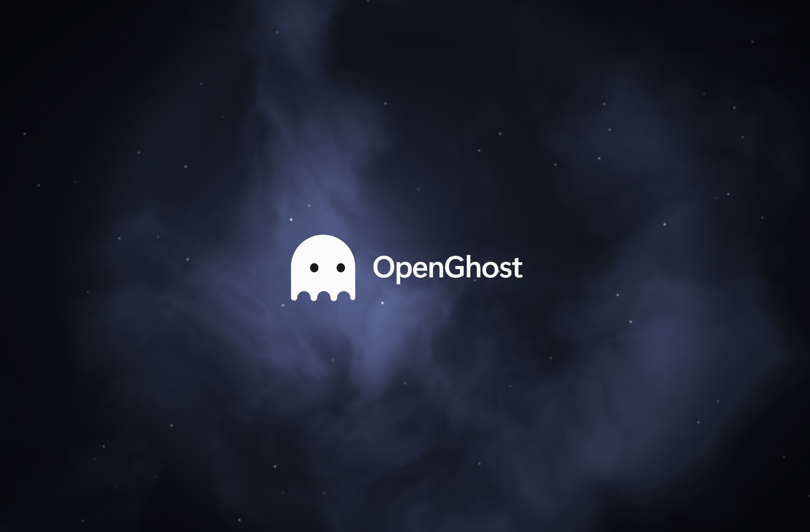
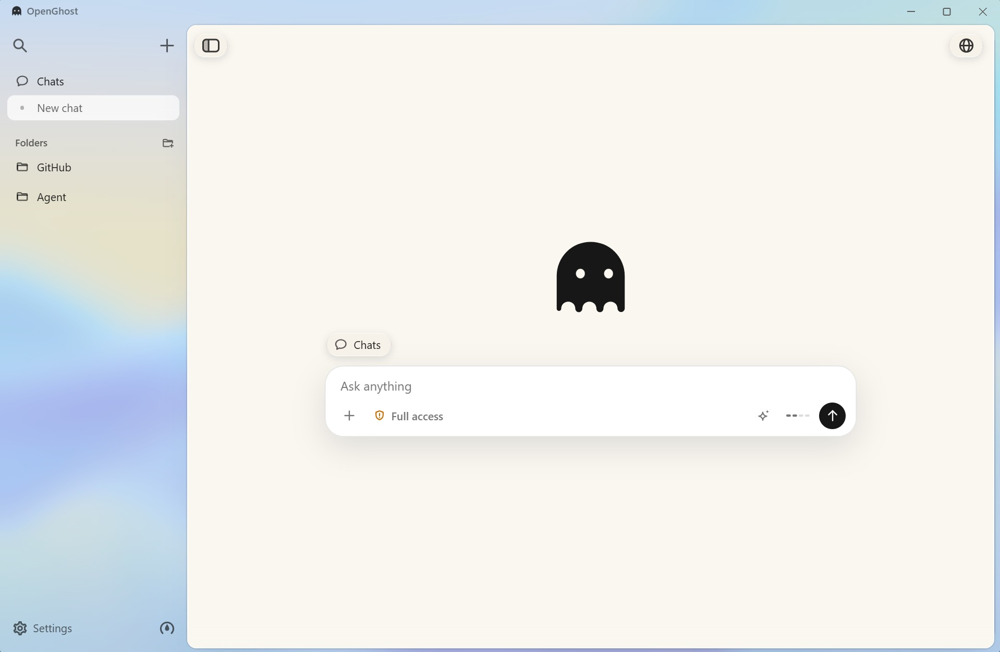
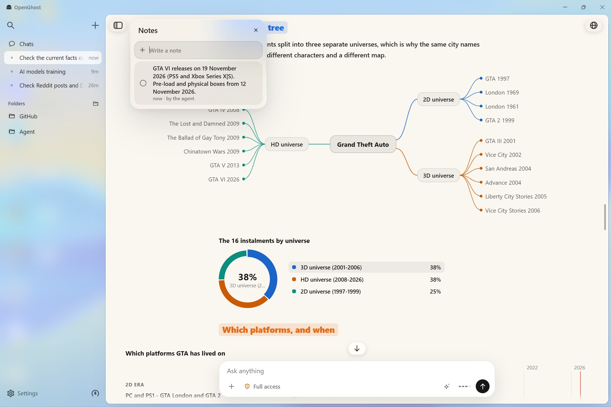
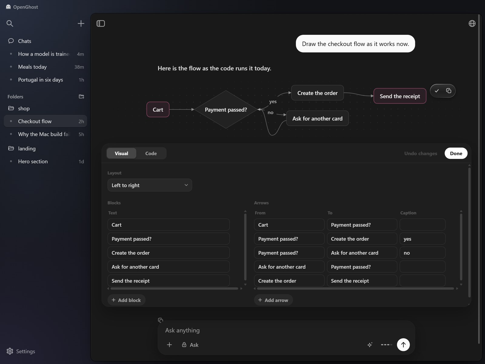
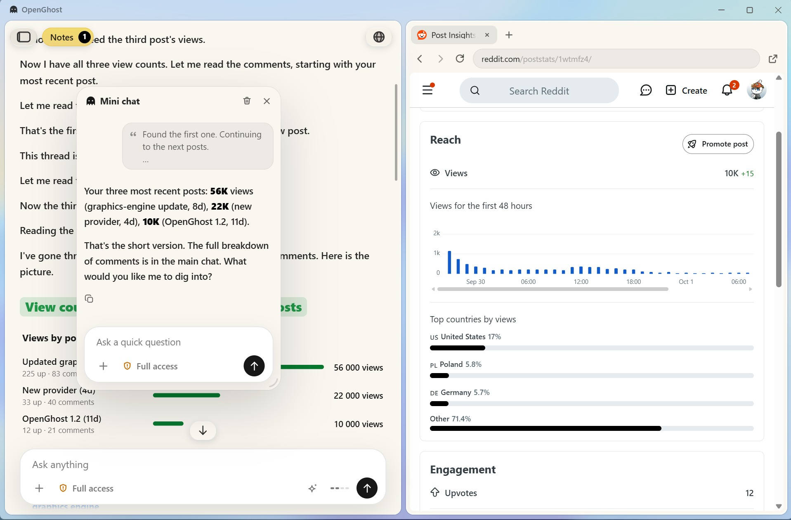
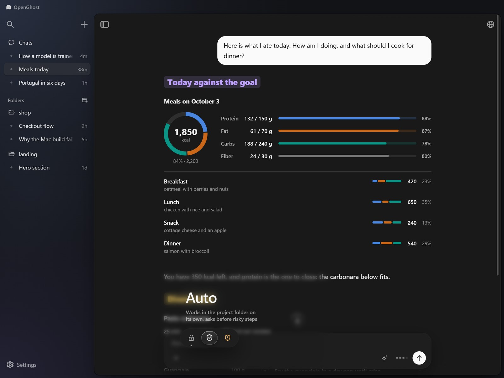
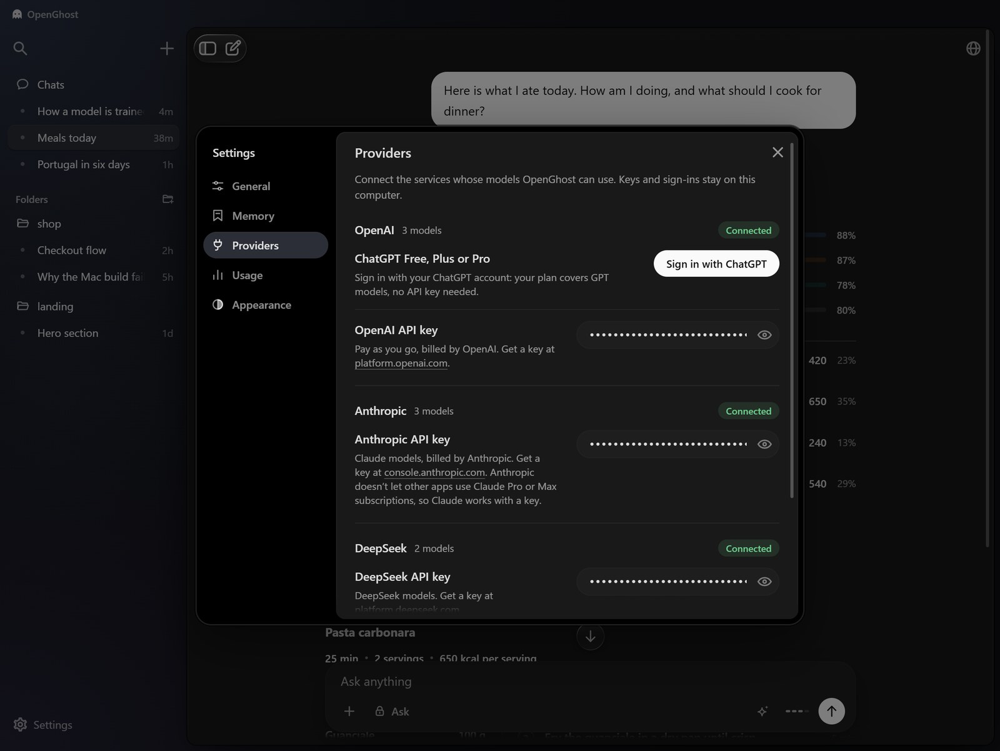

# OpenGhost

**v1.2.0 beta**

[Windows version 1.2.0](https://github.com/ANDRETRIPOL/OpenGhost/releases/download/v1.2.0/OpenGhost-1.2.0-Setup.exe)

[Linux version 1.2.0](https://github.com/ANDRETRIPOL/OpenGhost/releases/download/v1.2.0/OpenGhost-1.2.0-linux.tar.gz)

[macOS version 1.2.0](https://github.com/ANDRETRIPOL/OpenGhost/releases/download/v1.2.0/OpenGhost-1.2.0-mac.dmg)

What's new:
- Browser work is up to 10× cheaper on long sessions: the repeated part of each request comes from the provider's cache. The agent sees and does exactly what it did before.
- A light theme.
- Usage in the settings: tokens spent by day, week, month and all time, per provider and model, with your ChatGPT plan limits and DeepSeek balance.
- Clear approvals: in Ask mode the agent says in plain words what it wants to do, and the card shows what the step does and where.
- Rename chats right in the list. Effort shows its level name.
- API keys are encrypted by the operating system instead of kept in plain text.
- Cmd+A, C, V and Z work on Mac. On Linux, paths respect letter case, and approvals understand bash and zsh.
- A long paste turns into a card, and one click turns it back into text. Esc stops the agent from anywhere, instantly.

Older versions are on the [Releases](https://github.com/ANDRETRIPOL/OpenGhost/releases) page.

The code is under the MIT license. The name OpenGhost, the ghost logo, the animations, and the visual design are not. You may not use those for any commercial purpose. See LICENSE.

OpenGhost is an open desktop agent for Windows, macOS and Linux. The agent engine is written from scratch. It runs commands, edits files, keeps git, and works on the web. Its main advantage is visualization: when something can be shown, OpenGhost draws it. The rendering engine is written from scratch too.

## It opens with the ghost

The app starts on its own screen. The ghost arrives first, then the name OpenGhost.



## A chat lives in a folder

Every new chat belongs to a folder you choose. Until the first message, the ghost waits above the composer.



## Show the numbers, do not only tell them

Shares, flows, prices, and plans become charts and diagrams next to the explanation. One picture carries the idea.



## Change the diagram where it stands

A chart is not a finished picture. Open it and edit the layout, the blocks, and the arrows. The drawing updates in place.



## A browser with its own cursor

OpenGhost has a built-in browser and drives it itself. It opens a page, moves its own cursor, clicks, types, and sees what is on the screen. The panel sits on the right of the chat. Close it and the agent still works.


## Mini chat for a side question

Select a passage and open Mini chat over the conversation. It is the same agent, with the current chat as context. Nothing written there is saved, and closing the window throws it away.



## Three ways to let it act

Ask waits for approval before commands, file changes, and the web. Auto works inside the project folder and asks before a risky step. Full access does not ask.



## The key stays on this computer

OpenGhost works with ChatGPT, OpenAI, Claude, and DeepSeek. Keys and sign-ins are stored only on your machine, and the app checks them for you.



## Build it yourself

The same code runs on Windows, macOS and Linux. You need Node.js 22 or newer.

```
npm ci
npm start
```

`npm start` runs the app straight from the code. To make an installer, run the command for your system on that system:

- Windows: `npm run dist` makes `dist/OpenGhost-<version>-Setup.exe`
- macOS: `npm run dist:mac` makes `dist/OpenGhost-<version>-mac.dmg`
- Linux: `npm run dist:linux` makes `dist/OpenGhost-<version>-linux.tar.gz`

No Mac or Linux machine at hand? A fork can build both on GitHub: turn on Actions, open Build and press Run workflow. The files appear on the page of that run.

## Thanks

[@kodachromez](https://github.com/kodachromez) found eight real bugs in a single report, and [@Bruno8R](https://github.com/Bruno8R) noticed that API keys were kept in plain text. All of it is fixed in v1.2.0. Thank you both.
